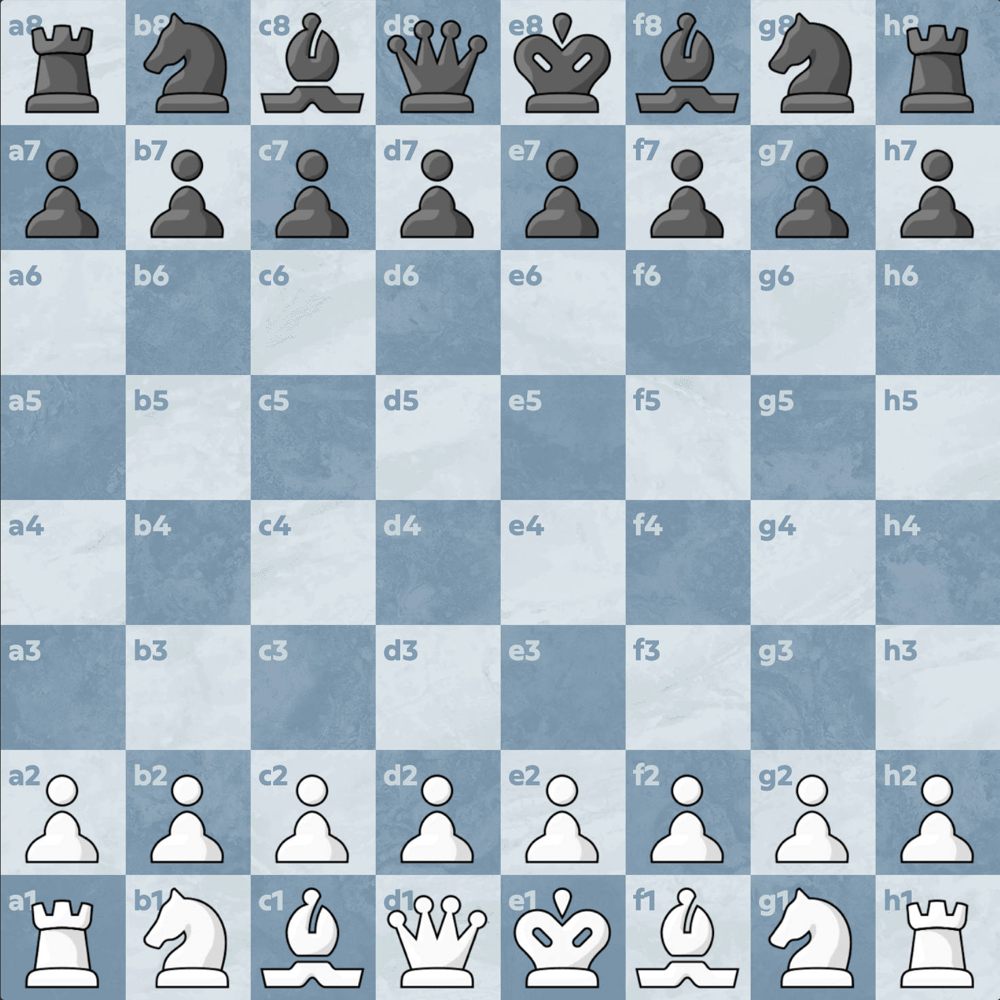

# Chess.com Full Coordinates

A lightweight Chrome/Edge extension that adds full-square coordinate labels to Chess.com boards, so every square shows labels like `a1`, `d4`, and `h8`.

The extension is designed to look native to Chess.com. It does not read moves, call APIs, analyze positions, or modify game logic. It only adds visual coordinate labels to the board.

## Preview

## Why This Exists

As a chess player, I always wanted to understand the board the way stronger players do. Grandmasters and experienced players can instantly recognize where every piece is and describe moves by their square names without hesitation.

This extension was built to make that skill easier to practice during normal play. Instead of only seeing the edge coordinates, every square is labeled directly on the board, helping players connect moves, pieces, and square names naturally over time.

## Features

- Shows coordinates on all 64 squares.
- Matches Chess.com board coordinate colors where available.
- Supports normal and flipped board orientation.
- Works across common Chess.com board pages, including play, bots, puzzles, analysis, and daily boards.
- Adds a `Full Coordinates` toggle inside Chess.com's board settings dialog.
- Keeps pieces clickable and draggable with `pointer-events: none` on the board overlay.

## Install Locally

1. Clone or download this repository.
2. Open Chrome or Edge and go to `chrome://extensions`.
3. Turn on `Developer mode`.
4. Click `Load unpacked`.
5. Select this repository folder.
6. Open `https://www.chess.com/` and start a game, puzzle, or analysis board.

## Usage

The coordinates are enabled by default.

To turn them on or off:

1. Open Chess.com's board settings.
2. Find `Full Coordinates`.
3. Toggle it on or off.

The setting is saved in your browser with `localStorage`.

## Files

- `manifest.json` - Manifest V3 extension definition.
- `src/content.js` - Board detection, overlay rendering, orientation handling, and settings toggle injection.
- `src/content.css` - Native-looking overlay and settings toggle styling.

## Notes

This is an unofficial extension and is not affiliated with Chess.com.
